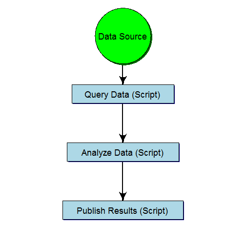
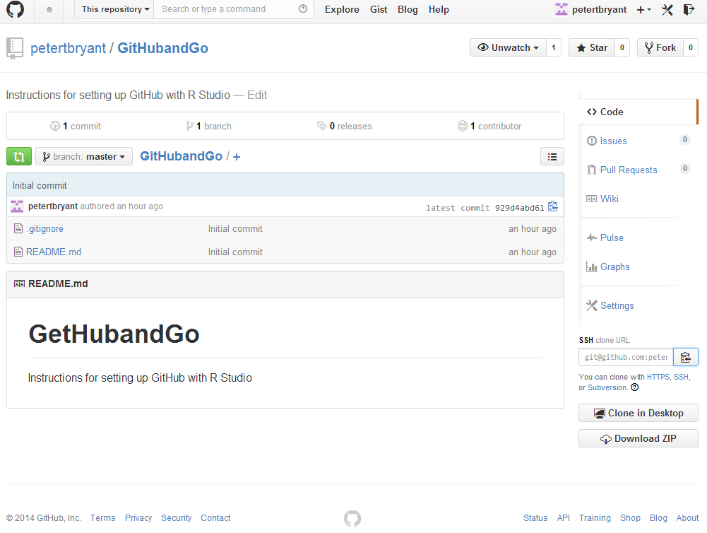
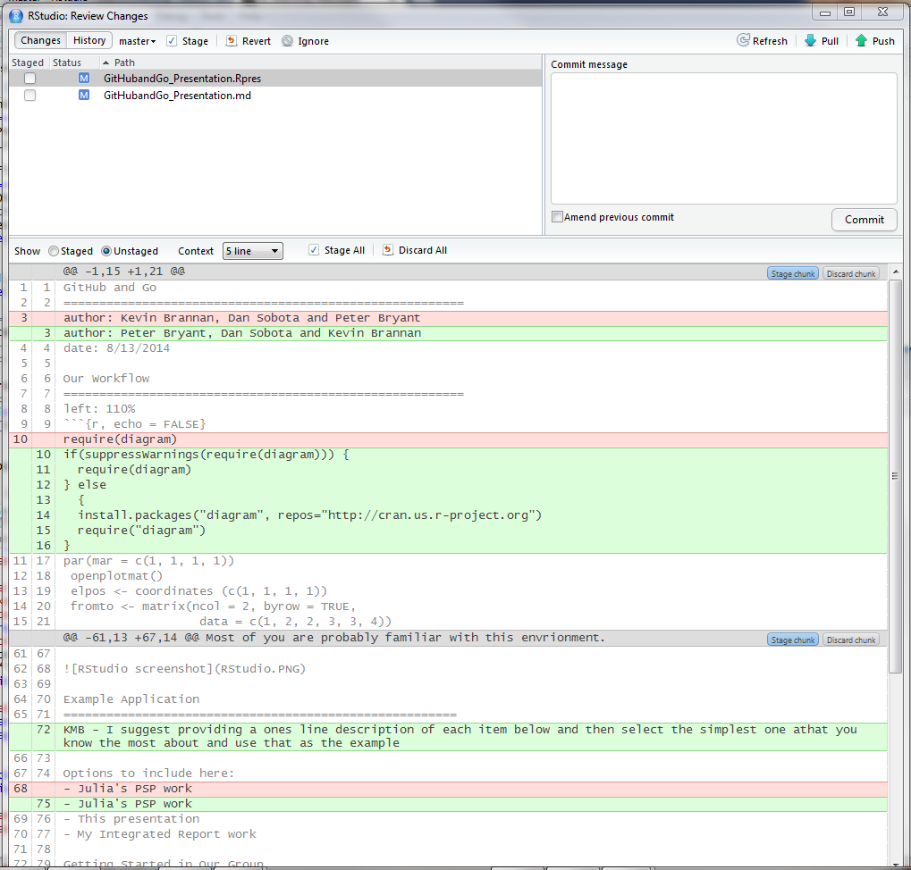
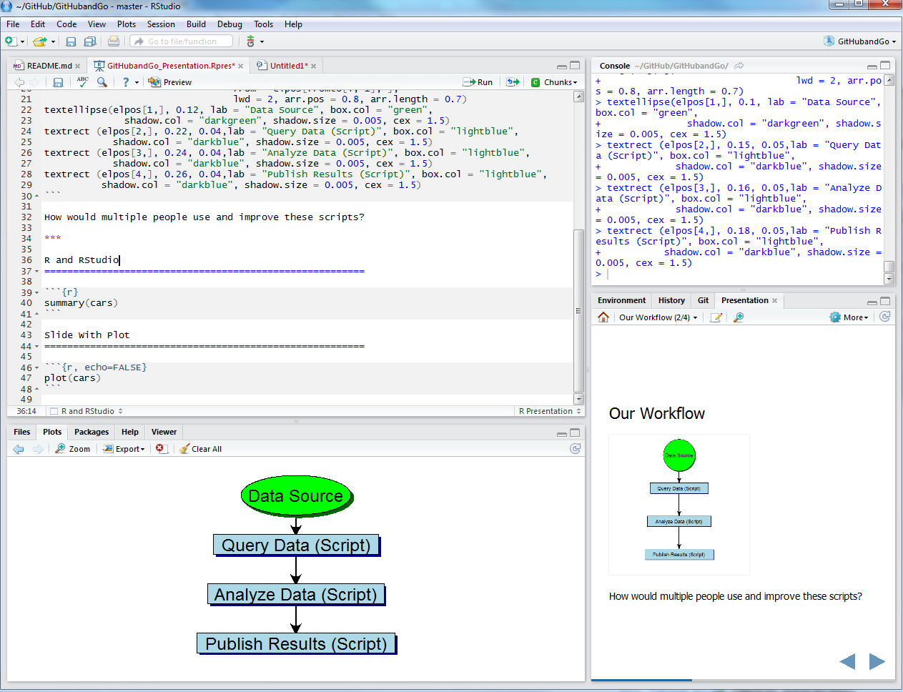

GitHub and Go
========================================================
author: Peter Bryant, Dan Sobota and Kevin Brannan
date: 8/13/2014

Our Workflow
========================================================
left: 110%
 

How would multiple people use and improve these scripts?

***

GitHub
========================================================

- GitHub is the online collaboration tool
  

Git
========================================================

- Git is the version control software
  

Version Control
========================================================

### Benefits
- Track changes
- Retrievable
- Workflow organization
- Collaboration opportunities

R and RStudio
========================================================

Most of you are probably familiar with this envrionment.

Example Application
=======================================================
KMB - I suggest providing a ones line description of each item below and then select the simplest one athat you know the most about and use that as the example

Options to include here:
- Julia's PSP work 
- This presentation
- My Integrated Report work 

Getting Started in Our Group
=======================================================

- Provide steps to set up GitHub and RStudio to group
- Peter and Dan will provide help
  - They will do this during the initial stage of our use of GitHub
  - They will only help with use and setup problems with using GiHub through RStudio
  - We will all be able to help each other as our proficiency with GitHub increases
  

=======================================================
# **Now Git Going!** 
## (Peter's pun)
# **Git 'ere done!**
## (Kevin's pun)
# **????**
## (Dan's pun)
