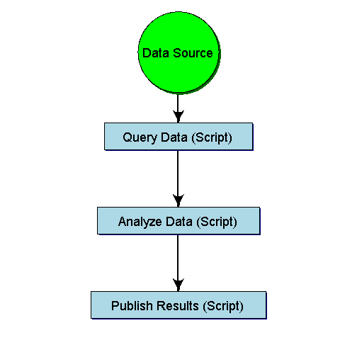
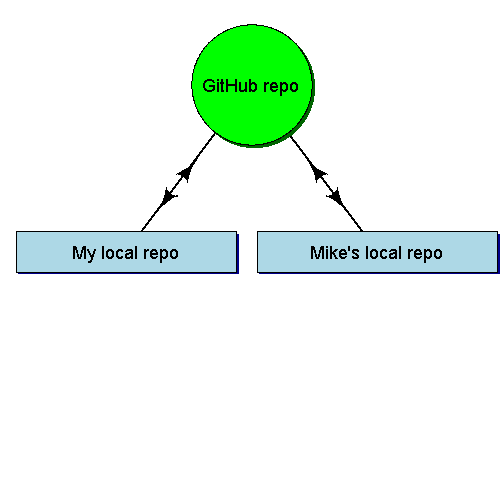

GitHub and Go
========================================================
Peter Bryant, Dan Sobota and Kevin Bannan  
9/2/2014

Our Workflow
========================================================
left: 110%
 

How would multiple people use and improve these scripts?

***

GitHub
========================================================

- GitHub is the online collaboration tool
  

Git
========================================================

- Git is the version control software
  

Version Control
========================================================

### Benefits
- Track changes
- Retrievable
- Workflow organization
- Collaboration opportunities
- Citeable (GitHub is starting to issue DOIs)

R and RStudio
========================================================

Many of you are probably familiar with R & RStudio.

Example Applications
=======================================================

- **Julia's PSP work**
  - R scripts to run aquatic life ratio calculations and per basin per station plots
- **This presentation**
  - Created using markdown files and contributed to by Dan, Kevin and Peter
- **Peter's Integrated Report work**
  - R and Python scripts for data query, cleaning, analysis and database updates
- **Dan's TMDL scripts**
  - R scripts for individual TMDL projects
  
  
Integrated Report Work
=======================================================
- Shared repository (repo) model  

 

TMDL scripts
=======================================================
- Scripts for individual TMDL projects organized by folder

- Data and other large files reside in folders outside the R project

Getting Started in Our Group
=======================================================

- Provide steps to set up GitHub and RStudio to group
- Peter and Dan will provide help
  - Have developed a start-up word document
  - They will do this during the initial stage of our use of GitHub
  - They will only help with use and setup problems with using GiHub through RStudio
  - We will all be able to help each other as our proficiency with GitHub increases
  
Additional reading
=======================================================

- [Git Book](http://git-scm.com/book)
- [Basic collaboration model description](https://help.github.com/articles/using-pull-requests/#a-quick-note-on-collaborative-development-models)

=======================================================
# **Now Git Going!** 
## (Peter's pun)
# **Git ' done!**
## (Kevin's pun)
# **Git confident (but not Hubris)!**
## (Dan's pun)
